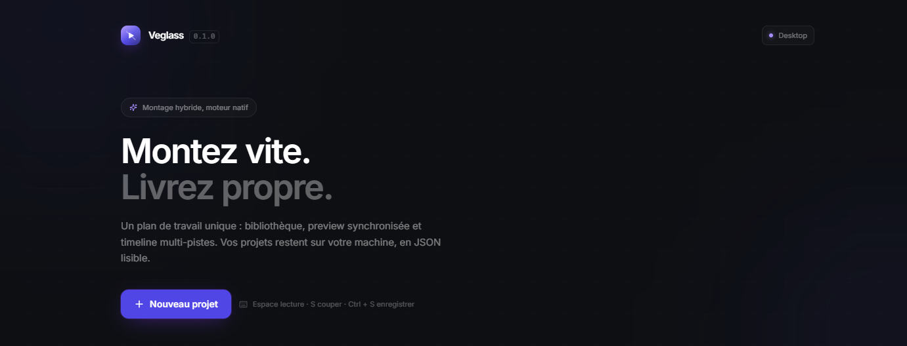
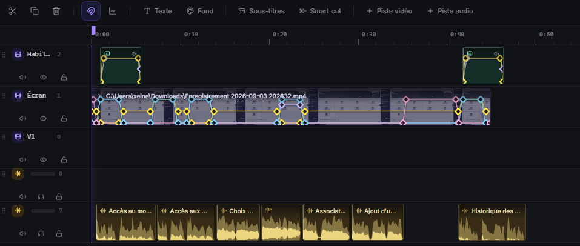
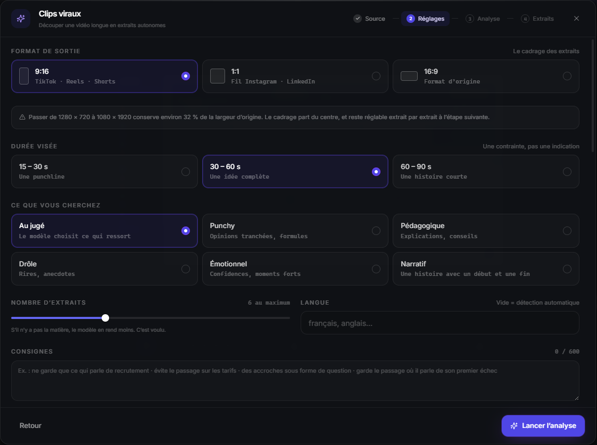
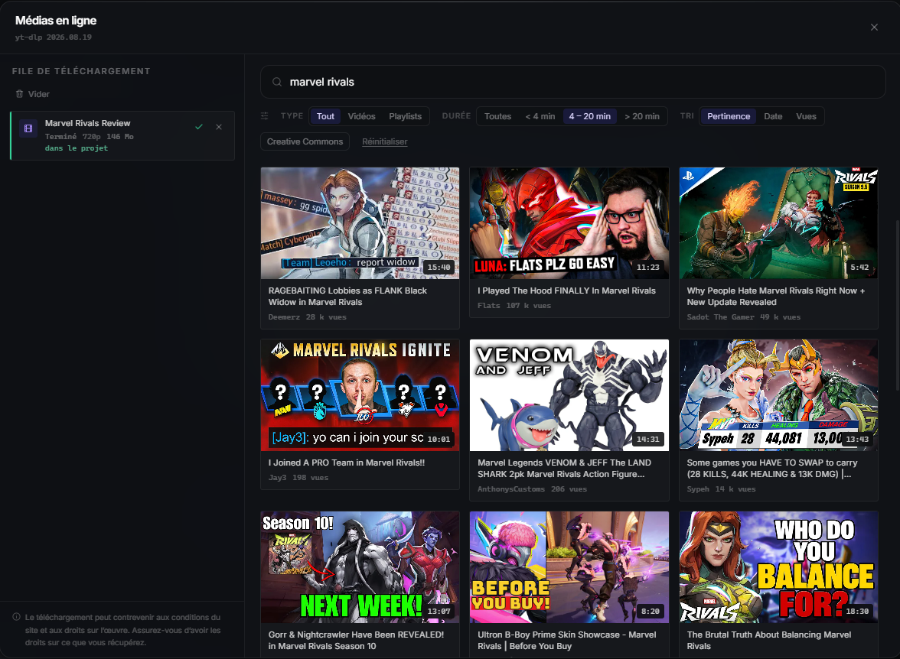
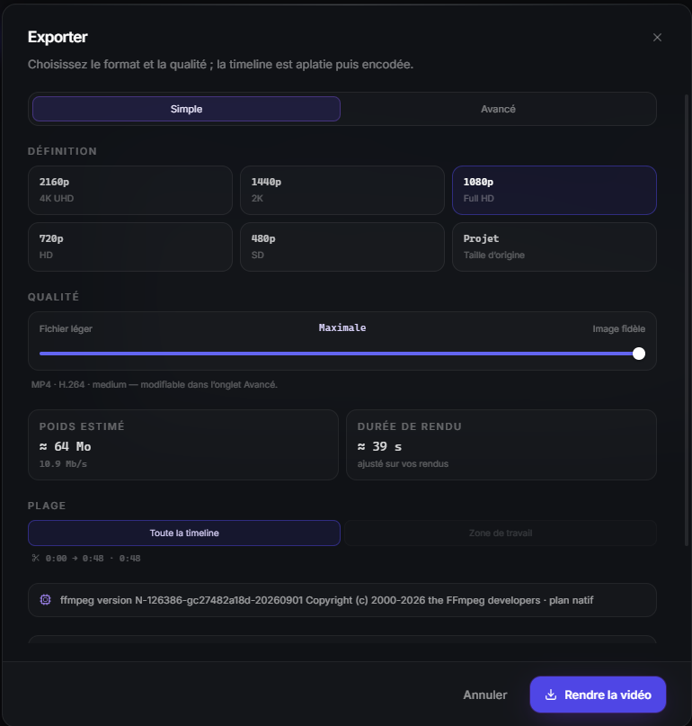

<p align="center">
  
</p>

<h1 align="center">Veglass</h1>

<p align="center">
  <strong>Un banc de montage vidéo qui tourne sur votre machine.</strong><br>
  Vos fichiers restent chez vous. Rien n'est téléversé, aucun compte requis.
</p>

---

## Démarrer

### Mode navigateur

Immédiat, aucune dépendance système.

```bash
npm install
npm run dev          # http://localhost:1420
```

L'application est entièrement fonctionnelle dans le navigateur : création de
projet, import par glisser-déposer, preview, timeline, montage.

Les projets sont enregistrés dans le `localStorage`, et les médias sont
référencés par `blob:` — ils ne survivent donc pas à un rechargement de page. La
bibliothèque signale les fichiers à réimporter.

### Mode desktop

Nécessite la toolchain Rust. L'export a en plus besoin de **ffmpeg** — sur le
`PATH`, à côté de l'exécutable, ou désigné par `VEGLASS_FFMPEG`. À défaut,
Veglass propose de le télécharger lui-même.

```bash
rustup default stable        # une fois
npm run desktop              # tauri dev
npm run desktop:build        # bundle signé (.msi / .exe / .dmg / .AppImage)
```

---

## La timeline



Autant de pistes vidéo et audio que nécessaire. Images clés sur la position,
l'échelle, la rotation, l'opacité et le volume — visibles ici sur la piste
« Écran », où chaque losange est un mouvement de caméra.

Six effets empilables et animables, trois transitions, un mixeur par piste avec
compresseur et filtres. Texte complet, fonds animés générés, bandeaux, repères
de chapitre.

> Cette capture montre la sortie du **générateur de tutoriels** : un
> enregistrement d'écran avec une caméra qui suit l'action, et la narration
> découpée en clips sur la piste du dessous.

---

## L'assistant



**Clips viraux.** Une vidéo longue entre ; Veglass l'écoute, repère les passages
qui tiennent debout seuls, et propose une série d'extraits notés. Chacun part
dans le projet ou devient une séquence verticale recadrée, sous-titrée, avec un
bandeau d'accroche sur les trois premières secondes.

Vous choisissez le format, la durée visée, le registre — et vous pouvez écrire
vos propres consignes en français. Veglass annonce ce que le recadrage coûte
avant de le faire.

**Sous-titres.** Transcription automatique, ou calage d'un texte que vous
fournissez — la seconde méthode est nettement plus fidèle. Ligne par ligne ou
mot par mot, animé.

**Brand kits.** Vos styles de sous-titres et d'accroche, enregistrés et
réutilisables d'un projet à l'autre. Trois modèles fournis.

**Tutoriels.** Un enregistrement d'écran brut entre, un montage sort : caméra
qui zoome sur ce qui compte, narration calée dessus, un chapitre par étape.

**Coupe intelligente.** Silences et hésitations détectés, supprimés en une seule
annulation.

**Assistant conversationnel.** Vous décrivez ce que vous voulez, en français. Il
propose, vous acceptez ou refusez — rien n'est appliqué sans votre accord.

**Reformatage.** Tout un projet du 16:9 au 9:16 : chaque image recadrée, chaque
titre repositionné, chaque mouvement de caméra recalculé.

> Ces fonctions demandent une clé Google AI Studio (gratuite), rangée dans le
> trousseau du système et jamais lisible depuis l'interface.

---

## Médias en ligne



Recherche YouTube avec filtres — type, durée, tri — puis téléchargement au
format et à la qualité de votre choix, ou piste audio seule. Les fichiers
récupérés se comportent comme des imports locaux.

> Le téléchargement peut contrevenir aux conditions d'utilisation du site et aux
> droits sur l'œuvre. C'est votre responsabilité.

---

## Export



Rendu par ffmpeg : résolution, qualité, encodeur — accélération matérielle quand
la machine en a une. Le poids et la durée sont estimés avant de lancer, et
l'estimation s'ajuste sur vos rendus précédents.

Voix de synthèse en option, via une clé ElevenLabs : la narration se pose sur la
timeline comme un clip audio, avec atténuation automatique de la musique.

En mode desktop, Veglass vérifie discrètement au lancement s'il existe une
version plus récente. Hors ligne, il n'en parle pas et s'ouvre normalement.

---

## Où sont vos données

| | |
|---|---|
| Projets | `%APPDATA%\app.veglass.editor\projects` |
| ffmpeg et yt-dlp | `%APPDATA%\app.veglass.editor\bin` |
| Clés d'API | Trousseau du système |

Un projet est un `.json` qui *référence* vos médias sans les copier. Déplacer un
fichier source ne casse rien : Veglass propose de le relocaliser.
